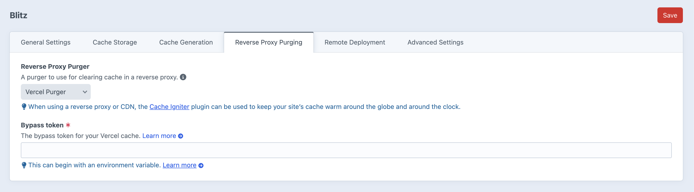

# Blitz Vercel Purger

[]((https://packagist.org/packages/esign/craft-blitz-vercel))
[](https://packagist.org/packages/esign/craft-blitz-vercel)

<p align="center"></p>

The Vercel Purger plugin allows the [Blitz](https://putyourlightson.com/plugins/blitz) plugin for [Craft CMS](https://craftcms.com/) to intelligently purge pages cached on [Vercel](https://vercel.com).

**Note that Vercel charges for invalidation requests. Since
invalidation requests can quickly add up when purging individual URLs, you
should be aware of the potential costs. esign takes no responsibility
whatsoever for expenses incurred.**

## Requirements

This plugin requires Craft CMS 5.0.0 or later, and PHP 8.2 or later.

## Installation

You can install this plugin from the Plugin Store or with Composer.

#### From the Plugin Store

Go to the Plugin Store in your project’s Control Panel and search for “Blitz Vercel Purger”. Then press “Install”.

#### With Composer

Open your terminal and run the following commands:

```bash
# go to the project directory
cd /path/to/my-project.test

# tell Composer to load the plugin
composer require esign/craft-blitz-vercel

# tell Craft to install the plugin
./craft plugin/install blitz-vercel
```

## Usage

After installing the plugin, you can use the plugin in the control panel under Settings > Blitz > Cache Purger.

```php
// The purger type to use.
'cachePurgerType' => 'esign\craftblitzvercel\VercelPurger',

// The purger settings.
'cachePurgerSettings' => [
   'bypassToken' => 'YOUR_BYPASS_TOKEN',
],
```

More information about the Vercel Build Output API can be found [here](https://vercel.com/docs/build-output-api/v3/features#on-demand-incremental-static-regeneration-isr).

## License

The MIT License (MIT). Please see [License File](LICENSE.md) for more information.

### Screenshot

